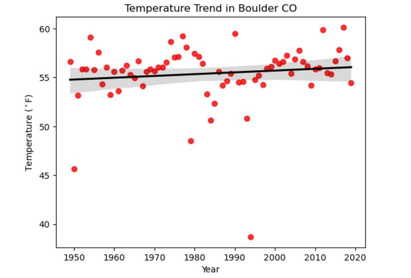
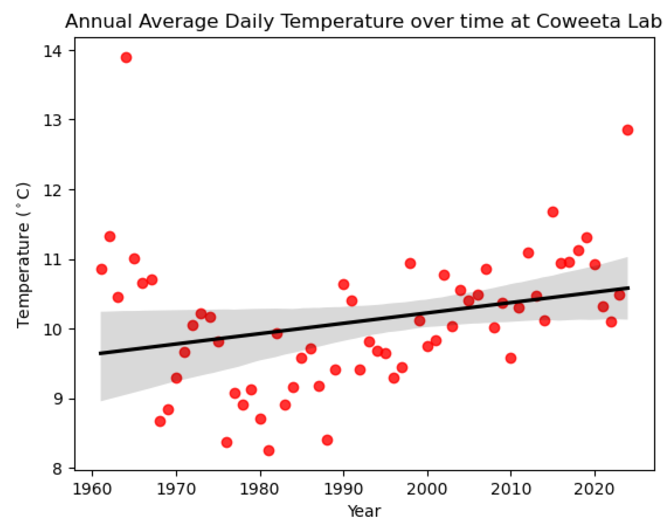
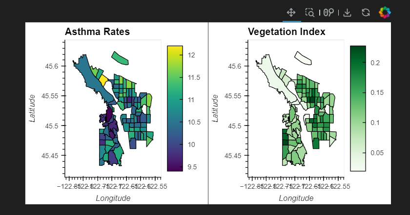
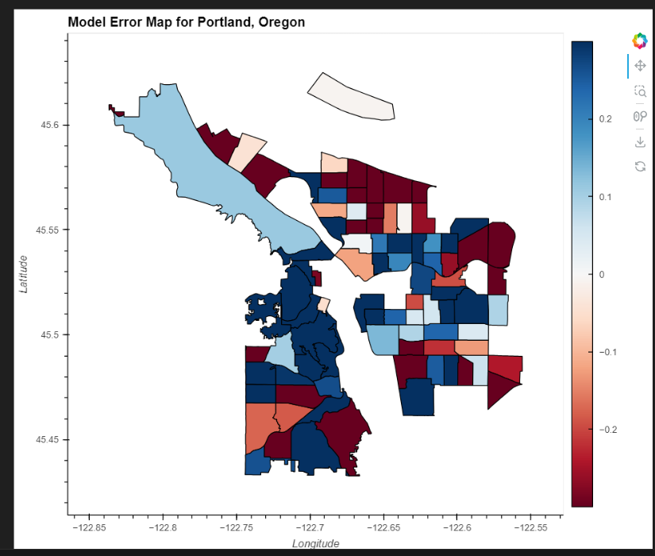

# Documenting my Learning Adventure 
This adventure made possible through the University of Colorado Boulder
and the [Environmental Data Science Innovation and Inclusion Lab](https://esiil.org/)

### Contact Information
* Email: <a href="mailto:r_neff@southwesterncc.edu">r_neff@southwesterncc.edu</a>
* [LinkedIN](https://www.linkedin.com/in/randi-neff-b7a27823b/)

I have been the Project Coordinator for the Smoky Mountain STEM Collaborative {SMSC} at SCC since 2018. SMSC is part of 
[NASA's SciAct community](https://science.nasa.gov/learn/science-activation-team/). Southwestern is the nation's only 
community college to have a collaborative partnership with NASA which started in 2015. My background is in science education
with 16 years experience teaching High School and I have an M.S. in Biology with many years teaching at the college level. In addition, 
I also worked as the assistant director for Western Carolina University's Upward bound Math & Science program in the 1990s. 
My passions are inspiring young people to answer their own questions and supporting those who live and work in western North Carolina.

# My Projects for the [Earth Data Analytics Professional Graduate Certificate](https://earthlab.colorado.edu/earth-data-analytics-professional-graduate-certificate)
## Adding a Map - we learned to:
* Define geospatial vector data
* Search for geospatial features
* Construct a map and embed it into a portfolio website

### SMSC is located at Southwestern Community College shown in the map below.
<embed type="text/html" src="img/uttc.html" width="600" height="600">
The land where SCC is located is the ancestral home of the Eastern Band of the Cherokee Indians in the mountains of western North Carolina and 
not far from the Qualla Boundary where the Cherokee People reside. This is my home too and I hope to foster stewardship of this land through data.
Creating an interactive map using Open Street Map was our first assignment.  

## Climate Coding Challenge - we learned to:
* Analyze temperature data over time
* Parse date information so that it is represented as a datetime type
* Use operators to convert to different units
* Resample time-series data to different frequencies
  
### Our guided learning focused on Denver Colorado (elevation 5280ft) and then we selected a new location and used data from The Global Historical Climatology Network. Below is a comparison of temperature trends in North Carolina and Denver Colorado.

### Here is [my python code](/post/nc_climate.html) showing extraction and analysis of data from Coweeta Hydrologic Lab (elevation 2200-3800ft). I chose Coweeta because it is near where I live and work and has been collecting data for a long time. Note that it's hard to compare the two trendlines because one is in degrees Fahrenheit and the other is in degrees Celsius. However, the slope on both plots show a gradual trend upward. If I weren't trying to finish the rest of the assignments, I might run some additional statistics, but for now I'm thrilled I can share this part of my work especially since hurricane Helene caused the NOAA data center to be offline for a little while.

## Mapping Migration - Species Distribution challenge - we learned to:
* Combine different types of vector data with spatial joins
* Create a chloropleth plot
  
### This Interactive Map of Veery Migration was our guided learning exercise and then we picked another species to try on our own.
<embed type="text/html" src="img/migration.html" width="600" height="600">

The Veery or <i>Catharus fuscescens</i>, is part of the Turdidae family. It is found in the southeastern US during migration and it may be able to anticipate hurricanes in the Atlantic according to a study by Christopher Heckscher. Unfortunately, Atlantic hurricanes tend to coincide with Veery migration and have a negative impact on their breeding season. This is an example of species that is studied in phenology - the impact of a changing climate on the cyclical pattern of an organisms life history.

## Habitat Suitability Project - we learned to:
* Create a habitat suitability model.
* The model is based on combining multiple data layers related to soil, topography, and climate.
* I chose native Rivercane - <i>Arundinaria gigantea</i> - because restoration efforts are relevant locally

### My work on this project can be viewed [here](https://github.com/BioNCphilic/rivercane). It is a work in progress which I plan to complete during the spring semester. Previously I worked with SCC student Stella Walborn using the TourIt platform from [Infiniscope](https://infiniscope.org/) and a wealth of resources from regional groups to create a virtual tour of rivercane in WNC. You can find that [here](https://p.tourit.etx.asu.edu/v1fshqa2/0wf7eb0e1oddykg/index.html). 

## Sources:

* Open Street Map "Southwestern Community College - Jackson Campus (601443373), Sept. 2024 [https://www.openstreetmap.org/way/601443373](https://www.openstreetmap.org/way/601443373)
* Heckscher, Christopher M. 2018. “A Nearctic-Neotropical Migratory Songbird’s Nesting Phenology and Clutch Size Are Predictors of Accumulated Cyclone Energy.” Scientific Reports 8 (1): 9899. [https://doi.org/10.1038/s41598-018-28302-3](https://doi.org/10.1038/s41598-018-28302-3).
* GBIF.org (27 October 2024) GBIF Occurrence Download [https://doi.org/10.15468/dl.r463v3](https://doi.org/10.15468/dl.r463v3)

# Modeling Urban Asthma Rates

### A comparison of asthma rates with the geographic distribution of healthy vegetation as determined by NDVI.

### The result of this model shows that access to greenspace can explain some of the geographic distribution of asthma, but other factors are involved. 

### Here is [my python code](/post/corrected_portland_model.html) for the model.
Please note there are some data gaps due to changes made recently on the CDC website.

# Land Classification Project
### This project used an unsupervised K-means clustering algorithm to group land cover pixels by similar spectral signatures. This study will use the [harmonized Sentinal/Landsat multispectral dataset](https://lpdaac.usgs.gov/documents/1698/HLS_User_Guide_V2.pdf) to look at patterns in vegetation data. The HUC region 8 watershed extends from Missouri to the Gulf of Mexico and the lower extent near New Orleans is the focus for this analysis. The EPA ecoregion designation is Mississippi Alluvial and SE Coastal Plains. According to a publication by the Louisiana Geological Survey, the area is comprised of "...a diversity of grasses, sedges, and rushes." However, there has been a tremendous amount of human engineering of this environment.

### Sources
* USDA (2012), Response to RFI for Long-Term Agro-ecosystem Research (LTAR) Network, available online at: https://www.ars.usda.gov/ARSUserFiles/np211/LMRBProposal.pdf.
* John Snead, Richard P. McCulloh, and Paul V. Heinrich (2019) Landforms of the Louisiana Coastal Plain, Louisiana Geological Survey, available online at: https://www.lsu.edu/lgs/publications/products/landforms_book.pdf 
