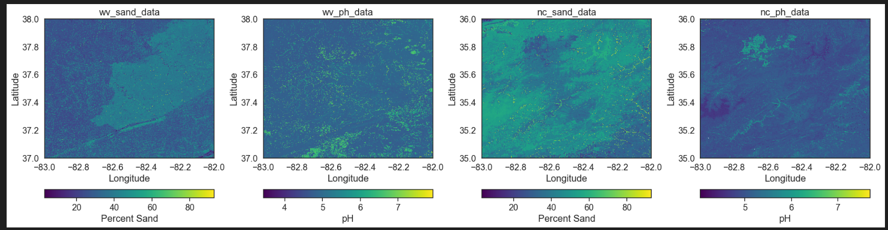

# Documenting my Learning Adventure 
This adventure made possible through the University of Colorado Boulder
and the [Environmental Data Science Innovation and Inclusion Lab](https://esiil.org/)

### Contact Information
* Email: <a href="mailto:r_neff@southwesterncc.edu">r_neff@southwesterncc.edu</a>
* [LinkedIN](https://www.linkedin.com/in/randi-neff-b7a27823b/)

I have been the Project Coordinator for the Smoky Mountain STEM Collaborative {SMSC} at SCC since 2018. SMSC is part of 
[NASA's SciAct community](https://science.nasa.gov/learn/science-activation-team/). Southwestern is the nation's only 
community college to have a collaborative partnership with NASA which started in 2015. My background is in science education
with 16 years experience teaching High School and I have an M.S. in Biology with many years teaching at the college level. In addition, 
I also worked as the assistant director for Western Carolina University's Upward bound Math & Science program in the 1990s. 
My passions are inspiring young people to answer their own questions and supporting those who live and work in western North Carolina.

# My Projects for the [Earth Data Analytics Professional Graduate Certificate](https://earthlab.colorado.edu/earth-data-analytics-professional-graduate-certificate)
## Adding a Map - we learned to:
* Define geospatial vector data
* Search for geospatial features
* Construct a map and embed it into a portfolio website

### SMSC is located at Southwestern Community College shown in the map below.
<embed type="text/html" src="img/uttc.html" width="600" height="600">
The land where SCC is located is the ancestral home of the Eastern Band of the Cherokee Indians in the mountains of western North Carolina and 
not far from the Qualla Boundary where the Cherokee People reside. This is my home too and I hope to foster stewardship of this land through data.
Creating an interactive map using Open Street Map was our first assignment.  

## Climate Coding Challenge - we learned to:
* Analyze temperature data over time
* Parse date information so that it is represented as a datetime type
* Use operators to convert to different units
* Resample time-series data to different frequencies
  
### Our guided learning focused on Denver Colorado (elevation 5280ft) and then we selected a new location and used data from The Global Historical Climatology Network. Below is a comparison of temperature trends in North Carolina and Denver Colorado.

### Here is [my python code](/post/nc_climate.html) showing extraction and analysis of data from Coweeta Hydrologic Lab (elevation 2200-3800ft). 
I chose Coweeta because it is near where I live and work and has been collecting data for a long time. Note that it's hard to compare the two trendlines because one is in degrees Fahrenheit and the other is in degrees Celsius. However, the slope on both plots show a gradual trend upward. If I weren't trying to finish the rest of the assignments, I might run some additional statistics, but for now I'm thrilled I can share this part of my work especially since hurricane Helene caused the NOAA data center to be offline for a little while.

## Mapping Migration - Species Distribution challenge - we learned to:
* Combine different types of vector data with spatial joins
* Create a chloropleth plot
  
### This Interactive Map of Veery Migration was our guided learning exercise and then we picked another species to try on our own.
<embed type="text/html" src="img/migration.html" width="600" height="600">

The Veery or <i>Catharus fuscescens</i>, is part of the Turdidae family. It is found in the southeastern US during migration and it may be able to anticipate hurricanes in the Atlantic according to a study by Christopher Heckscher. Unfortunately, Atlantic hurricanes tend to coincide with Veery migration and have a negative impact on their breeding season. This is an example of species that is studied in phenology - the impact of a changing climate on the cyclical pattern of an organisms life history.

## Habitat Suitability Project - we learned to:
* Create a habitat suitability model.
* The model is based on combining multiple data layers related to soil, topography, and climate.
* I chose native Rivercane - <i>Arundinaria gigantea</i> - because restoration efforts are relevant locally

### My work on this project can be viewed [here](https://github.com/BioNCphilic/rivercane). 
This is a work in progress which I plan to complete eventually. Previously I worked with SCC student Stella Walborn using the TourIt platform from [Infiniscope](https://infiniscope.org/) and a wealth of resources from regional groups to create a virtual tour of rivercane in WNC. You can find that [here](https://p.tourit.etx.asu.edu/v1fshqa2/0wf7eb0e1oddykg/index.html). 

## Sources:

* Open Street Map "Southwestern Community College - Jackson Campus (601443373), Sept. 2024 [https://www.openstreetmap.org/way/601443373](https://www.openstreetmap.org/way/601443373)
* Heckscher, Christopher M. 2018. “A Nearctic-Neotropical Migratory Songbird’s Nesting Phenology and Clutch Size Are Predictors of Accumulated Cyclone Energy.” Scientific Reports 8 (1): 9899. [https://doi.org/10.1038/s41598-018-28302-3](https://doi.org/10.1038/s41598-018-28302-3).
* GBIF.org (27 October 2024) GBIF Occurrence Download [https://doi.org/10.15468/dl.r463v3](https://doi.org/10.15468/dl.r463v3)

# Modeling Urban Asthma Rates
## The learning goals for this project were: 
* Access larger-than-memory data in chunks
* Compute fragmentation statistics
* Compare urban greenspace distribution to health outcomes

### In urban areas, vegetation can help clean the air from traffic and other air pollutants although simple measurements such as NDVI (Normalized Difference Vegetation Index) which document vegetative health have shown mixed results. The relationship between metrics such as mean patch size, edge density, fragmentation and human health may help quantify the benefit of greenspaces in an urban environment. This project investigated that idea.

A comparison of asthma rates with the geographic distribution of healthy vegetation as determined by NDVI. Note that there are some correlation of areas with lots of vegetation (dark green) correspond to areas with low rates of asthma (purple) are identifiable in the side by side maps. 

To test the strength of this correlation, a linear ordinary least squares (OLS) regression model was used and shows that access to greenspace can explain some of the geographic distribution of asthma, but other factors are involved. 

### Here is [my python code](/post/corrected_portland_model.html) for the model. Please note there are some data gaps due to changes made on the CDC website.

# Land Classification Project
## The learning goals for this project were:
* Group pixels by similar spectral signatures using K-means clustering algorithm
* Use a pickle to store and retrieve an object
* Use a decorator to modify and extend functions
  
### This project used an unsupervised K-means clustering algorithm to group land cover pixels by similar spectral signatures. The K-means algorithm helps to reveal patterns or clusters that have minimal within-cluster variation. This study used the [harmonized Sentinal/Landsat multispectral dataset](https://lpdaac.usgs.gov/documents/1698/HLS_User_Guide_V2.pdf) to look at patterns in vegetation data. The HUC region 6 watershed covers the drainage of the Tennessee River Basin from Kentucky to the Gulf of Mexico. Most of the Tuckasegee River basin, where I live, is within this region is forested.

### The [image above](https://www.ncpedia.org/geography/jackson) shows the location of Jackson County in North Carolina where the Tuckaseegee River originates.

## Land Cover Interpretation based on Spectral Data
According to a publication by the North Carolina Department of Environmental Quality [1], the middle of the Tuckasegee River watershed shown in this analysis "...drains the west-central portion of Jackson County...[and] traditionally, land use in the watershed was agricultural with light residential and commercial activity along the transportation corridors". In 2008, the NC Department of Mitigation Services designated Savannah Creek along with 18 other tributaries were identified for "...restoring wetland and stream functions such as maintaining and enhancing water quality, restoring hydrology, and improving fish and wildlife habitat."[2].

Looking at the cluster analysis, # 1 may be vegetation along the river itself due to limited riparian buffer zones. Between 2001-2011 in unit 06010203 impervious surfaces increased by an average of 27 acres with forest converted by development (31 acres) or agriculture (2 acres). Clusters 2 and 3 dominate the plot and are most likely different forest types while clusters 4 and 5 are probably tied to residential and agricultural regions.

## Here is [my python code for the cluster analysis](/post/clustering_nc.html)

### Sources
1. Tuckasegee River Subbasin HUC 06010203. 2006 available online [HERE](https://files.nc.gov/ncdeq/Water%20Quality/Planning/BPU/BPU/Little_Tennessee/Little%20Tennessee%20Plans/2012%20Plan/3_06010203%20Tuckasegee.pdf)
2. Little Tennessee River Basin Restoration Priorities. June 2008. Amended 2018. available online [HERE](https://www.deq.nc.gov/mitigation-services/publicfolder/learn-about/core-processes/watershed-planning/little-tenn-river-basin/rbrp-ltn-2018/download#:~:text=The%20basin%20encompasses%20a%201%2C797,of%20TLWs%20and%20selected%20characteristics.&text=quality%2C%20restoring%20hydrology%2C%20and%20improving,River%20Basin%20are%20listed%20below.&text=other%20nongovernmental%20groups%20to%20protect%20and%20restore%20watersheds%20through%20restoration%20and%20preservation.&text=Middle%20Cr%2034%200.3%208%204%20mi%20of%20L)

# Habitat Suitability Project
## The learning goals for this project were:
* Extend the work from the previous habitat suitability project to include 4 climate scenarios
* Create a modular and reproducible workflow combining multiple data layers related to soil, topography, and climate.

_Rhododendron maximum_ is found in North Carolina and West Virginia which are both part of the Appalachian Mountains. Dudleya, et al identify _Rhododendron maximum_ as an emerging foundation species following the decline of the American Chestnut and Eastern Hemlock. In addition, "Rhododendron affects numerous riparian forest ecosystem processes, including decomposition and nutrient cycling." Of the four hardiness division established by Sakai, et al, _Rhododendron maximum_ is listed in the very hardy category with a tolerance for temperatures down to -40 F, although the USDA recommends a minimum temperature of -13 F with 150 frost free days. _Rhododendron maximum_ is adapted to medium & coarse textured soils with drought tolerance and medium tolerance for fire. It is found at elevations up to 6200 feet which includes all of Wayne County, WV and most of Jackson County, NC except for the highest peak Richland Balsam on the Blue Ridge Parkway. 

### This project intended to compare different climate models using [MACAv2 data](https://www.climatologylab.org/maca.html), however various roadblocks led to an [incomplete project using pseudocode](https://github.com/earthlab-education/habitat-suitability-BioNCphilic/blob/main/climate.ipynb). I was able to establish the current distribution of _Rhododendron maximum_ as shown below using data from the [Global Biodiversity Information Facility](https://www.gbif.org/). 

### In addition, the elevation of both counties provides suitable habitat as shown below.

If I had been successful in extracting minimum temperature data from the MACAv2 data, the next step would be to harmonize all rasters with the soil pH and percent sand composition of soils - shown below - along with the elevation data to analyze a consensus model of habitat suitability.

### Information Sources
* Maura P. Dudleya, Mary Freeman, Seth Wenger, Rhett Jackson, and Catherine M. Pringle. 15 September 2020. Rethinking foundation species in a changing world: the case for Rhododendron maximum as an emerging foundation species in shifting ecosystems of the Southern Appalachians. Forest Ecology and Management Volume 472, p. 118240. available online: [https://doi.org/10.1016/j.foreco.2020.118240](https://doi.org/10.1016/j.foreco.2020.118240)
* A. Sakai, L. Fuchigami, and C.J. Weiser. 1986. Cold Hardiness in the Genus Rhododendron. Journal of the American Society for Horticultural Science 111(2):273-280.
* USDA PLANTS Database. [available online](https://plants.usda.gov/plant-profile/RHMA4/characteristics)

# Capstone Project: Comparison of Surface Mineral Alteration by Fire at Two Different Scales
## Project Team: Fellow classmate [Hannah Rieder](https://github.com/hanried) and NEON data science advisor [Bridget Hass](https://github.com/bhass-neon)
### Project Overview:
We will investigate the mineral content of the Earth’s surface based upon reflectance data and develop a [python tutorial](https://github.com/NEONScience/AOP-EMIT/tree/main) for others seeking to use these two datasets. We expect that to find a correlation NEON and EMIT data and therefore, expand data products available to NEON data users. In addition, we hope to analyze differences in mineral content before and after burning by wildfires. Using two different scales will allow us to use detailed information from NEON to interpret broader patterns found in EMIT data. “Ground truthing” with NEON data will help identify sources of variability in EMIT data and reduce the influence of outliers. Mineral identification for the EMIT library is effective for areas without dense vegetation and moisture, so comparison with NEON reflectance data may help minimize potential issues by clarifying signal interference sources.

A previous study by Park and Sim (2023) showed that Landsat and Lidar measures of burn severity were comparable and Lidar has been used to document tree mortality in difficult forest terrains (Bueno et al., 2025).  The EMIT instrument on the International Space Station introduces the potential of extending Lidar measurements to include surface minerals. Handler (2019) noted that “...fire hazard pose threats to physical, biological, and social values in the project area such as: soil stability, hydrology and air quality, [and] wildlife habitat…” This project aims to develop another tool for evaluating forest restoration needs based upon soil characteristics using the EMIT mineral spectral library to classify local NEON spectral data. Understanding the severity of fire at the mineral level as well as the landscape level will be valuable to forest managers.

### Project Workflow

Our general method will be to identify co-located EMIT L2B Estimated Mineral Identification data with NEON Airborne Observation Platform data in the Sierra National Forest Soaproot Saddle site where the Creek Fire (2020) and the Blue Fire (2021) occurred. The downloaded EMIT data after being orthorectified, will be used to create distribution maps based upon the library for 10 specific minerals. Cluster analysis will be used to classify the NEON data and then compare it with the EMIT maps. Ultimately, we would like to understand how fire disturbances affect Earth surface minerals and create a road map for future explorations of co-located data from these two sources. 

### Below is an image (from Google Earth Engine) showing an RGB band combo of the 2024 AOP SOAP hyperspectral data with the southern part of the Creek Fire boundary.

Listed below are a variety of resources used to support our project. 

### EMIT Data & Resources 
EMITL2BMIN “provides estimated mineral identification and band depths in a spatially raw, non-orthocorrected format” (Green, 2023). Each granule has two NetCDF4 files with a 60 m spatial resolution that include mineral identification and uncertainty estimate. Minerals identified in this dataset include: calcite, chlorite, dolomite, goethite, gypsum, hematite, illite+muscovite, kaolinite, montmorillonite, and vermiculite. 
* [https://github.com/nasa/EMIT-Data-Resources](https://github.com/nasa/EMIT-Data-Resources)
* [https://github.com/nasa/VITALS](https://github.com/nasa/VITALS)
* [https://github.com/emit-sds/emit-main/wiki/Repository-Guide](https://github.com/emit-sds/emit-main/wiki/Repository-Guide)

### NEON Data & Resources
This is hyperspectral raster data distributed in an open HDF5 format in UTM projection showing scaled reflectance. Each file contains all 426 reflectance bands for a single 1 km by 1 km tile. 
* [https://www.neonscience.org/data](https://www.neonscience.org/data)
* [https://github.com/NEONScience/VITALS/blob/main/setup/setup_instructions.md](https://github.com/NEONScience/VITALS/blob/main/setup/setup_instructions.md)
* [https://github.com/NEONScience/VITALS/tree/main](https://github.com/NEONScience/VITALS/tree/main)

### My Jupyter Notebook for our project can be found [HERE](https://github.com/NEONScience/AOP-EMIT/tree/rneff)
Note: we are in the early stages of this project which will be completed in August 2025. 

#### Sources: 
* Bueno, I. T., Silva, C. A., Anderson-Teixeira, K., Magee, L., Zheng, C., Broadbent, E. N., Zambrano, A. M. A., & Johnson, D. J. (2025). Aboveground Biomass and Tree Mortality Revealed Through Multi-Scale LiDAR Analysis. Remote Sensing, 17(5), 796. [https://doi.org/10.3390/rs17050796](https://doi.org/10.3390/rs17050796)
* Green, R. (2023). EMIT L2B Estimated Mineral Identification and Band Depth and Uncertainty 60 m V001. NASA Land Processes Distributed Active Archive Center. [https://doi.org/10.5067/EMIT/EMITL2BMIN.001](https://doi.org/10.5067/EMIT/EMITL2BMIN.001)
* Handler, C. (2019). Sierra National Forest Forestwide Prescribed Fire Project: Updated Purpose, Need and Proposed Action. United States Department of Agriculture. [https://firerestorationgroup.org/snf-forestwide-rx-burn](https://firerestorationgroup.org/snf-forestwide-rx-burn)
* NEON (National Ecological Observatory Network). Spectrometer orthorectified surface bidirectional reflectance - mosaic (DP3.30006.002), provisional data. Dataset accessed from [https://data.neonscience.org/data-products/DP3.30006.002](https://data.neonscience.org/data-products/DP3.30006.002) on April 15, 2025. 
* Park, T., & Sim, S. (2023). Characterizing spatial burn severity patterns of 2016 Chimney Tops 2 fire using multi-temporal Landsat and NEON LiDAR data. Frontiers in Remote Sensing, 4. [https://doi.org/10.3389/frsen.2023.1096000](https://doi.org/10.3389/frsen.2023.1096000)
